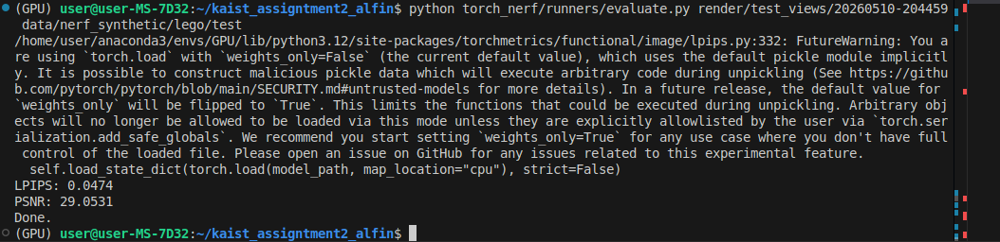

# CS479 Assignment 2 — NeRF Implementation Notes

**Student:** Alfin William  
**Course:** KAIST CS479: Machine Learning for 3D Data (Spring 2026)

---

## Overview

For this assignment, I implemented the main sampling and rendering parts of a basic NeRF pipeline. The files I worked on are related to ray sampling, stratified sampling, and volume rendering.

The basic NeRF pipeline is:

```text
Camera → Cast Rays → Sample Points → Query Neural Network → Volume Rendering → Pixel Color
```

NeRF represents a 3D scene using a neural network. The network takes a 3D position and viewing direction as input, then predicts color and density. After that, volume rendering is used to combine the sampled points along each ray into the final pixel color.

---

## Task 1-1 — Ray Sampling

**File:** `torch_nerf/src/cameras/rays.py`

In this part, I computed the 3D sample positions along each ray.

The ray equation is:

```python
r(t) = o + t * d
```

where:

* `o` is the ray origin
* `d` is the ray direction
* `t` is the sampled distance along the ray

The main implementation was:

```python
sample_coords = ray_origins[:, None, :] + ray_directions[:, None, :] * t_samples[:, :, None]
```

The important part here was handling the tensor shapes correctly with PyTorch broadcasting.

Input shapes:

```text
ray_origins:    [num_ray, 3]
ray_directions: [num_ray, 3]
t_samples:      [num_ray, num_sample]
```

Output shape:

```text
sample_coords:  [num_ray, num_sample, 3]
```

---

## Task 1-2 — Stratified Sampling

**File:** `torch_nerf/src/renderer/ray_samplers/stratified_sampler.py`

For stratified sampling, I divided each ray into equal bins and randomly sampled one point inside each bin.

Instead of always sampling fixed positions, the model sees slightly different sample points each time. This helps the network learn a smoother scene representation instead of memorizing fixed locations.

Simple visualization:

```text
Bins:    |----|----|----|----|
Samples: |--x-|-x--|---x|-x--|
```

The sampling formula is:

```text
t_i ~ Uniform[
  near + (i-1)/N * (far-near),
  near + i/N * (far-near)
]
```

Implementation:

```python
t_bins = self.create_t_bins(num_bin=num_sample, device=device)
t_bins = t_bins[None, :].expand(num_ray, num_sample)

t_samples = t_bins + torch.rand_like(t_bins) * (1.0 / num_sample)
t_samples = self.map_t_to_euclidean(t_samples, near, far)
```

First, I created evenly spaced bins in `[0, 1]`. Then I added a random offset inside each bin. Finally, I mapped the values from `[0, 1]` to the actual `[near, far]` range.

---

## Task 2 — Volume Rendering

**File:** `torch_nerf/src/renderer/integrators/quadrature_integrator.py`

This part combines the predicted colors and densities along a ray into one final pixel color.

The volume rendering process has four main steps.

---

### Step 1 — Compute Alpha

Alpha represents how much each sample blocks light.

```text
α_i = 1 - exp(-σ_i * δ_i)
```

where:

* `σ_i` is the density at sample `i`
* `δ_i` is the distance to the next sample

Higher density or larger distance makes the sample more opaque.

---

### Step 2 — Compute Transmittance

Transmittance tells how much light reaches the current sample.

```text
T_i = product of (1 - α_j), for all samples before i
```

This needs to be an exclusive cumulative product because the current sample should only be affected by the samples before it, not by itself.

Transmittance follows the same principle as the Beer-Lambert law in physics — light traveling through a medium loses intensity exponentially based on the density of the material it passes through, which is exactly what $T_i = \exp(-\sum_{j<i} \sigma_j \delta_j)$ models.

Implementation:

```python
T = torch.cumprod(
    torch.cat(
        [torch.ones_like(alpha[:, :1]), 1.0 - alpha + 1e-10],
        dim=-1
    ),
    dim=-1
)[:, :-1]
```

The `1e-10` is added for numerical stability.

---

### Step 3 — Compute Weights

The weight of each sample is:

```text
w_i = T_i * α_i
```

This means a sample contributes more if light can reach it and if it has enough opacity.

```python
w_i = alpha * T
```

---

### Step 4 — Compute Final RGB

The final pixel color is the weighted sum of all sampled colors along the ray.

```text
RGB = sum(w_i * color_i)
```

Implementation:

```python
rgb = torch.sum(w_i[:, :, None] * radiance, dim=1)
```

---

## What I Learned

Through this assignment, I understood the NeRF pipeline much better.

The main idea is that NeRF does not directly store a mesh or voxel grid. Instead, the 3D scene is represented inside a neural network.

For each camera ray, we sample points in 3D space, ask the network for color and density at those points, and then use volume rendering to combine them into a pixel color.

I also learned why stratified sampling is useful. If the same fixed points are always sampled, the model can overfit to those exact positions. Randomly sampling within bins gives better coverage along the ray and helps the model learn a smoother representation.

For volume rendering, the most important idea is that points closer to the camera can block points behind them. This is why transmittance is needed.

One crucial component I did not implement but relied on is positional encoding — raw $(x, y, z)$ coordinates are mapped to high-frequency sinusoidal features before being fed into the MLP, which allows the network to learn fine details like sharp edges and textures that a plain MLP would otherwise smooth over.

---

## Evaluation

The assignment uses LPIPS and PSNR for evaluation.

| Metric  | Meaning                                               | Target for Full Credit |
| ------- | ----------------------------------------------------- | ---------------------- |
| LPIPS ↓ | Perceptual image similarity. Lower is better.         | ≤ 0.06                 |
| PSNR ↑  | Image reconstruction quality in dB. Higher is better. | ≥ 28.00                |

Quantitative results from my implementation on the lego scene using the provided checkpoint:

```text
LPIPS = 0.0474
PSNR  = 29.0531
```



This satisfies the full-credit requirement (LPIPS ≤ 0.06 and PSNR ≥ 28.00).

---

## Files Modified

| File                                                           | Description                       |
| -------------------------------------------------------------- | --------------------------------- |
| `torch_nerf/src/cameras/rays.py`                               | Ray sample coordinate computation |
| `torch_nerf/src/renderer/ray_samplers/stratified_sampler.py`   | Stratified sampling               |
| `torch_nerf/src/renderer/integrators/quadrature_integrator.py` | Volume rendering integration      |
